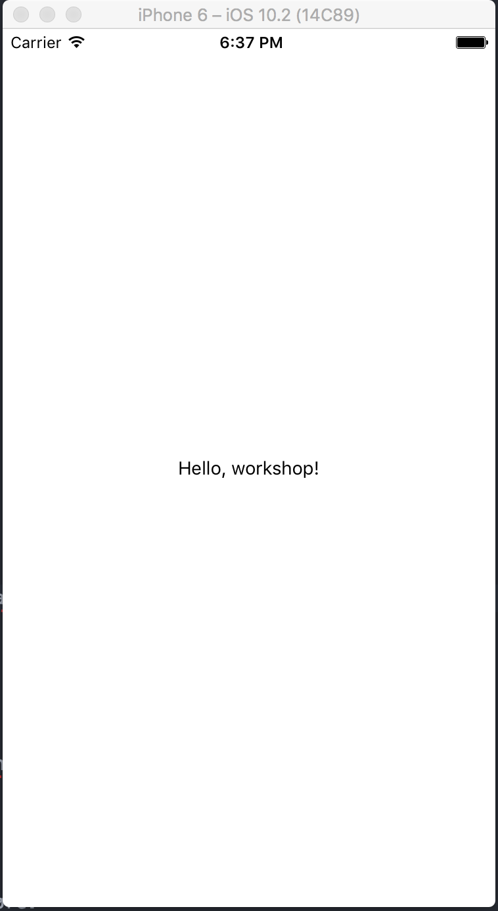

# Oppgave 1

## Målet med oppgaven
Målet med denne oppgaven er å få din første React Native app til å kjøre i iOS simulatoren.

## Oppsett
- OS X
- Xcode 7.0 eller nyere
- Node.js 4.0 eller nyere
- Watchman
- React Native CLI (`npm install -g react-native-cli`)

## Initialisering prosjektet
`cd` til rot-mappen av prosjektet (som burde hete react-native-workshop-v2) og kjør `npm install`.

https://facebook.github.io/react-native/docs/getting-started.html#quick-start inneholder nyttig informasjon om starte nye prosjekter (til senere referranse).

## Kjøre prosjektet
Husk at å kjøre et React Native prosjekt har to komponenter; en packager og en iOS runtime.

Innenfra prosjekt mappen kan du starte React Native packager med `npm start`(dette er egentlig et alias for `node node_modules/react-native/local-cli/cli.js start`)

For å starte iOS simulatoren med uten å åpne Xcode med `react-native-cli run-ios`

## Din oppgave
Få prosjektet til å kjøre i iOS simulatoren.

Hvis du ser skjermbildet over, gratulerer! Du kan nå gå videre til oppgave 2.

https://github.com/bekk/react-native-workshop-v2/blob/1-intro/tasks/task2.md
