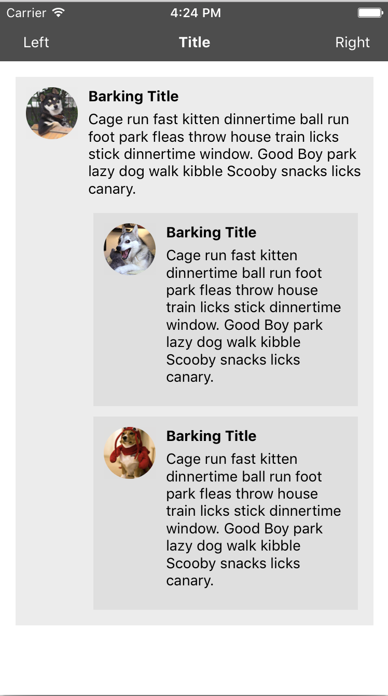

# Styling

## Målet med oppgaven
Målet med denne oppgaven er at du skal bli kjent med styling og layout i React Native.

## Oppsett
Start prosjektet slik som tidligere med `react-native run-ios`

## Definere styling
React Native bruker ikke CSS til å style elementene. Man definerer derimot stylingen med javascript-objekter, som er inspirert av CSS.

```css
.element {
  background-color: red;
  width: 20px;
  border: 1px solid black;
}
```

...blir til

```javascript
{
  element: {
    backgroundColor: 'red',
    width: 20,
    borderColor: 'black',
    borderWidth: 1
  }
}
```

Styling arves (cascading) ikke.

```
<View style={{ color: 'red' }} >
  <Text>Jeg er ikke rød</Text>
</View>
```

Men du kan kombinere styles.
```javascript
<View>
  <Text style={ [styles.defaultText, styles.red, styles.centered] }>Jeg er rød og sentrert</Text>
</View>

// ...

const styles = StyleSheet.create({
  defaultText: {
    fontSize: 12,
  },
  red: {
    color: 'orange',
  },
  centered: {
    textAlign: 'center',
  },
})
```
## Layout
React Native bruker `Flexbox` til å definere hvordan komponenter skal forholde seg til hverandre. `Flexbox` fungerer likt i React Native som på web, med noen få unntak. `flexDirection` sin default-verdi er `column` istedenfor `row`, og `flex`paramteret støtter kun et tall.
https://facebook.github.io/react-native/docs/flexbox.html

Husk at `<View>` tilsvarer `<div>` i HTML, `<Text>` tilsvarer `<p>`, og at `<Image>` tilsvarer ``.

## Din oppgave

### Del 1
Vi skal starte med å lage en verktøylinje. Verktøylinjen skal ha en knapp til høyre, en knapp til venstre, og en tittel i senter.

Som du ser vises tekstene vertikalt, en etter en. For at det skal ligne mer på verktøylinje skal tekstene vises horisontalt. Tittelen skal være fleksibel i bredden avhengig av enhetens bredde, mens knappene skal ha en fast bredde. Legg inn ønsket bakgrunnsfarge på verktøylinjen (På bildet under har vi brukt `#4d4d4d`)


Prøv gjerne å bytte orientering på simulatoren (`Command + høyre/venstre piltast`), og du vil se at tittelen tilpasser seg til bredden.

Hvis tekstfargen på statuslinjen irriterer deg, kan du bruke `StatusBar` komponentet til å endre på den. https://facebook.github.io/react-native/docs/statusbar.html

### Del 2
Det neste vi skal legge til er innhold etter verktøylinjen. Utvid `render` metoden med følgende komponenter.

``` javascript
render() {
    return (
        <View style={ styles.mainContainer }>
            <View style={ styles.toolbar }>
                ...
            </View>
            <View style={ styles.content }>
                <Text>This is the content</Text>
            </View>
        </View>
    );
}
```

Vi har nå lagt til en ytre container, som inneholder en verktøylinje og innholdet som består av en tekst. Det neste vi kan gjøre er å legge til en bakgrunnsfarge (`red`) på innholdet. Du vil nå se at innholdet ikke fyller hele skjermen.


Dette er ikke bra nok for en utvikler som deg, så det neste du skal gjøre er å få innholdet til å fylle hele skjermen uavhengig av enhet.

### Del 3
Det neste vi skal gjøre er å legge inn et mer spennende innhold. Mer spesifikt skal vi lage et sosialt nettverk for hunder, iallefall deler av et. Under ser du hvordan et innlegg skal se ut etter at du er ferdig.


En ting først.. bytt ut den røde bakgrunnsfargen med en hvit (`white`).

Vi har laget et komponent (`DogPost`) for et innlegg, din jobb er å style det slik at det ser ut som på bildet over. Start med å importere komponentet i toppen av `index.ios.js` (`import DogPost from './src/DogPost'`). Erstatt `<Text>This is the content</Text>` i render metoden med dette komponentet.

``` javascript
render() {
    return (
        <View style={ styles.mainContainer }>
            <View style={ styles.toolbar }>
                ...
            </View>
            <View style={ styles.content }>
                <DogPost />
            </View>
        </View>
    );
}
```

### Ekstraoppgave
Hvis de forrige oppgavene var for enkle kan du utvide `DogPost` slik at vi kan ha nestede komponenter med forskjellige bakgrunnsfarge slik som på bildet under.


