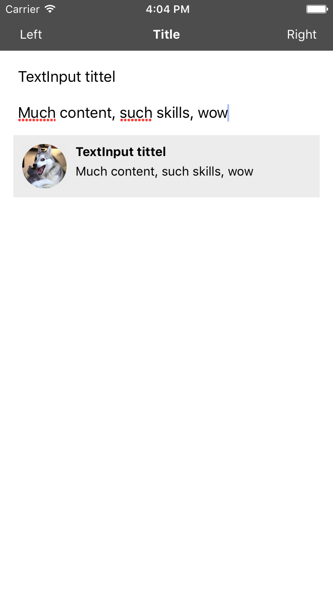

# State og props

Tilstandsløse applikasjoner er kjedelige. I denne oppgaven skal vi lage en appliasjon som faktisk gjør noe.

## Oppsett
Vi starter der vi sluttet i forrige oppgave, innholdet i `ìndex.ios.js` og `src/DogPost.js` er det samme som fasiten for forrige oppgave. Start prosjektet slik som tidligere med `react-native run-ios`

## Din oppgave

### Del 1
Utvid `DogPost.js` til slik at tittel (`title`) og innhold (`post`) kan bli sendt inn som `props`. Erstatt  `<DogPost />` i `render` metoden med koden under og sjekk om tittelen og innholdet vises riktig.

```javascript
<DogPost
  title="Tittel som prop"
  description="Innhold som prop"
/>
```

Det neste vi skal gjøre er å la brukeren bestemme tittel og innhold. Lag to `TextInput`; en til tittel og en til innhold. Verdiene til disse skal lagres i `state`. Deretter skal verdiene sendes inn til `DogPost` som props, slik at endringer i `TextInput` vises slik som nedenfor.



Som du kanskje ser endrer bildet seg når man skriver inn en ny bokstav. Dette er fordi `props` endrer seg for hver bokstav vi skriver, som fører til en rerending av `DogPost`

### Del 2
Et innlegg som man kan endre teksten på er ikke veldig imponerende. Du skal derfor gjøre det mulig å lagre innholdet av `TextInput` komponentene til state, slik at man kan vise flere innlegg. Start med å legge til en knapp. Her er det fint å bruke `Button`, et av React Native sine innebygde komponenter. http://facebook.github.io/react-native/releases/0.47/docs/button.html#button


Når man trykker på knappen (`onPress`-prop) skal et objekt som inneholder `this.state.title` og `this.state.description` legges til i en liste (i `state`) over innlegg som har blitt lagret. `this.state.title` og `this.state.description` skal også nullstilles, slik at man enkelt kan fylle inn nye verdier.

Antall innlegg varierer avhengig av hvor mange innlegg man har lagret. For å dynamisk tilpasse visningen av innlegg (`DogPost`), skal vi benytte et av de innebygde komponentene. `FlatList` brukes til å vise en liste av lignende data. `FlatList` kan brukes til å vise lister av data som varierer i lengde. Komponentet har hovedsaklig to `props` vi trenger å bry oss om. `data` forventer en liste av objekter som inneholder informasjonen skal vises frem. `renderItem` tar et av elementene i listen og spesifereres hvordan det skal rendres.
https://facebook.github.io/react-native/docs/flatlist.html

Din oppgave er utvide `index.ios.js`, slik at man kan lagre og vise frem flere `DogPost` slik som på bildet under.


Nederst på skjermen ser du antageligvis en `warning`. `VirtualizedList: missing keys for items, make sure to specify a key property on each item...`

`key` brukes til av React til å bestemme hvilke av kompnentene i listen som har endret seg og derfor må rendres på nytt. Forsøk deg gjerne på å bruke `FlatList` sin prop `keyExtractor` til å spesifisere en unik key til hvert komponent i listen.
