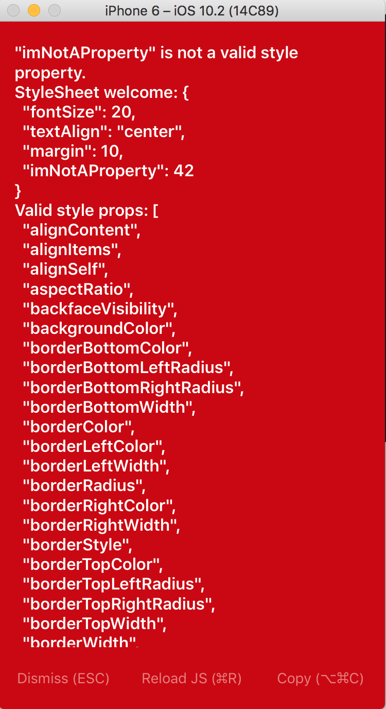

# Oppgave 2

## Målet med oppgaven
Målet med denne oppgaven er å bli komfortabel med enkel debugging og de grunnleggende React Native utviklingsverktøyene. Du vil debugge noen feil, og fikle litt med iOS simulatoren.

## Oppsett
Start med å kopiere følgende kode inn i `ìndex.ios.js`

```javascript
'use strict';
import React, { Component } from 'react'
import {
  AppRegistry,
  Image,
  StyleSheet,
  View
} from 'react-native';

class ReactNativeWorkshop extends Component {
  render() {
    imNotDefined

    return (
      <View style={styles.container}>
        <Text style={styles.welcome}>
          Nice work!
        </Text>
        <Text style={styles.instructions}>
          Now take a look around a bit with the dev tools.
        </Text>
        <Text style={styles.instructions}>
          Remember: press Cmd+R to reload,{'\n'}
          Cmd+D or shake for dev menu
        </Text>
      </View>
    );
  }
}

const styles = StyleSheet.create({
  container: {
    flex: 1,
    justifyContent: 'center',
    alignItems: 'center',
    backgroundColor: '#F5FCFF',
  },
  welcome: {
    fontSize: 20,
    textAlign: 'center',
    margin: 10,
    imNotAProperty: 42
  },
  instructions: {
    textAlign: 'center',
    color: '#333333',
    marginBottom: 10,
  },
  image: {
    height: 100,
    margin: 25,
    width: 200,
  },
});

AppRegistry.registerComponent('ReactNativeWorkshop', () => NotAComponent);
```

Start prosjektet slik som i forrige oppgave.

## Håndtere feil
Når du har startet prosjektet vil du antagelig klø deg i hodet og lure på hva du har gjort galt.



Dette er feilmeldingsskjermen som du antagelig vil se mange ganger.

Den inneholder en hjelpsom feilmelding og et stack trace av feilen under feilmeldingen. Merk at man må bruke musepekeren som en finger for å scrolle nedover i simulatoren.

## Utforsk utviklingsverktøyene
React Native kommer med flere kjekke utviklingsverktøy. Du kan få en oversikt over disse ved å klikke `cmd + D` i simulatoren. Lek deg gjerne med de forskjellige for å få følelsen av hva de kan gjøre.

## Din oppgave
Finn og fjern feilene i koden. Last inn javascript-koden på nytt (`cmd + R`) for å se om du fant den. Utforsk React Native sine utviklingsverktøy. Skru på `Live reload`og gjør noen valgfrie endringer i `ìndex.ios.js` og se effekten av de.
